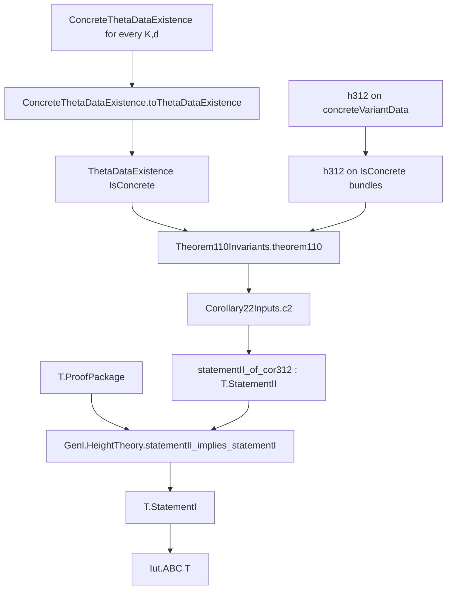

# Audit of LANA's Current Concrete IUT-to-ABC Implication

Date: 2026-09-01  
Audited upstream snapshot: [`lana-agents/iut@6e963070c73c5defd1012320deccc777e2555d22`](https://github.com/lana-agents/iut/tree/6e963070c73c5defd1012320deccc777e2555d22)  
Repository pin retained by this project: `ddaddc274281adb5674d647e24fa478745ac6d40`

## Scope and conclusion

The upstream snapshot adds a substantial conditional implication strand from a
variant of IUT IV, Corollary 3.12 to an abstract `genl` ABC target.  It does not
prove that Corollary 3.12 variant, construct all of the required concrete data,
or identify its abstract target with this repository's integer formulation
`IUTThreeClosures.ABCConjecture`.

There is also a decisive specification defect in the newly added concrete
interface.  `Iut.LocalTheory.componentVol_prime_preimage` is asserted for every
set, including the empty set.  Empty-set substitution proves that
`Iut.LocalTheory K` is uninhabited for every number field `K`.  Consequently no
branch of `ConcreteThetaDataExistence` that actually produces its advertised
local theory can be realized.  The conditional implication remains a correct
Lean theorem about its premises, but the premises do not currently encode a
nonvacuous concrete IUT construction.

This result rejects the exact total-real-valued volume interface in snapshot
`6e963070`; it does not reject Haar-volume scaling on its proper finite,
positive-volume domain, a repaired IUT formalization, or the mathematical abc
conjecture.

## Exact upstream theorem

The new declaration is in `Iut/Concrete/Main.lean:84`:

```lean
theorem Iut.cor312Variant_implies_abc_concrete
    {T : Genl.HeightTheory}
    {AG : AnabelianGeometry} {TG : TemperedGeometry AG}
    (A : T.ProofPackage)
    (I : ∀ (K : T.CBS) (d : ℕ), Corollary22Inputs T K d)
    (ex : ∀ K d,
      ConcreteThetaDataExistence (AG := AG) (TG := TG) (I K d))
    (cheb : ChebyshevBound)
    (pnt : PrimeCountingBound)
    (h312 : ∀ (D : InitialThetaData AG TG)
      (LT : LocalTheory D.Kt) (TL : ThetaLocalData D LT)
      (QI : QPilotInputs D),
      Corollary312Variant (concreteVariantData D LT TL QI)) :
    ABC T
```

Universe parameters have been suppressed in this display only.  The conclusion
is not this repository's integer abc statement.  In
`Iut/Abc/Target.lean:36`, upstream defines

```lean
def Iut.ABC (T : Genl.HeightTheory) : Prop := T.StatementI
```

and `Genl.HeightTheory.StatementI` is the abstract bounded-discrepancy statement

```lean
∀ X, T.Hyperbolic X → ∀ (d : ℕ) (ε : ℝ), 0 < ε →
  T.htCan X ≲[T.ptLE X d]
    (1 + ε) • (T.logDiff X + T.logCond X).
```

### Exact dependency DAG



More explicitly:

1. `ConcreteThetaDataExistence.toThetaDataExistence` converts each concrete
   existence premise into `ThetaDataExistence IsConcrete`.  A produced witness
   contains `D`, `LT : LocalTheory D.Kt`, `TL : ThetaLocalData D LT`,
   `QI : QPilotInputs D`, and `AI : ArithmeticInputs D`.  The construction uses
   `AI.invariants`, `AI.certificate`, and `AI.localEstimate`.
2. The concrete `h312` premise becomes the predicate-restricted premise
   `∀ X, IsConcrete X → Corollary312Variant X`.
3. `Iut.statementII_of_cor312` in `Iut/Implication/Corollary23.lean:56`
   calls `Corollary22Inputs.c2`.  Inside `c2`, `ThetaDataExistence.thetaData`
   supplies `X`, its invariants, certificate, local estimate, and comparison
   equalities.  It then invokes

   ```lean
   inv.theorem110 cert est pnt (h312 X hPX)
   ```

   where `Corollary312Variant X` is definitionally
   `X.qPilot.lhs ≤ X.rhsData.rhs`.
4. The resulting Corollary 2.2 inequality is extended over a finite exceptional
   set to prove `T.StatementII`.
5. `T.statementII_implies_statementI A` from `genl` turns `T.StatementII` into
   `T.StatementI`.  `Iut.ABC T` then unfolds to that same proposition.

Thus the theorem is conditional on all of the following independent inputs:

- a concrete `Genl.HeightTheory T` and `T.ProofPackage`;
- `Corollary22Inputs T K d` for every compactly bounded set and degree;
- concrete theta-data existence for every such `K,d`;
- `ChebyshevBound` and `PrimeCountingBound`;
- the Corollary 3.12 variant for every produced concrete bundle.

It is not a proof of any one of these inputs.

## The empty-set theorem for the latest `LocalTheory`

At `Iut/Concrete/LocalTheory.lean:188`, snapshot `6e963070` contains the field

```lean
componentVol_prime_preimage :
  ∀ {ι : Type} [Fintype ι] (p : Nat.Primes) (c : ι → Place K)
    (U : Set (Tensor (.finite p) c)),
  componentVol (.finite p) c
      ((fun x => ((p : ℕ) : Tensor (.finite p) c) * x) ⁻¹' U) =
    componentVol (.finite p) c U + Real.log p
```

There is no nonemptiness, measurability, finite-volume, positivity, or
admissibility premise on `U`.

### Proposition

For every field `K` with a `NumberField K` instance,
`Iut.LocalTheory K` is empty in snapshot `6e963070`.

### Proof

Assume `LT : LocalTheory K`.  Take the finite index type `ι = Empty`, the
unique function `c : Empty → Place K`, and the rational prime `p = 2`.  Let

\[
A=\operatorname{LT.Tensor}((2),c), \qquad
m_2:A\to A,\quad x\mapsto 2x,
\]

and write `V` for `LT.componentVol (.finite p) c`.  Apply the displayed field
to `U = ∅`.  Preimages preserve the empty set for every function, hence

\[
V(\varnothing)
=V(m_2^{-1}(\varnothing))
=V(\varnothing)+\log 2.
\]

Subtracting the finite real number `V(∅)` from both sides gives
`log 2 = 0`.  Since `2 > 1`, strict monotonicity of the real logarithm gives
`log 2 > 0`, a contradiction.  Therefore `LocalTheory K → False`. ∎

The proof needs neither a place of `K` nor an inhabitant of the tensor ring;
the empty index type supplies the required tuple and the empty subset exists
in every carrier.  It also does not use any disputed IUT theorem.

The following exact Lean audit was compiled against upstream `6e963070` after
`lake build Iut` completed all 8758 jobs:

```lean
theorem localTheory_false_latest
    (K : Type u) [Field K] [NumberField K]
    (LT : LocalTheory.{u,v} K) : False := by
  let p : Nat.Primes := ⟨2, Nat.prime_two⟩
  let c : Empty → Place K := fun x => nomatch x
  have h := LT.componentVol_prime_preimage p c
    (∅ : Set (LT.Tensor (.finite p) c))
  simp only [Set.preimage_empty] at h
  dsimp [p] at h
  have hlog : 0 < Real.log (2 : ℝ) := Real.log_pos (by norm_num)
  linarith
```

Lean reported only the standard axioms
`[propext, Classical.choice, Quot.sound]`.  The checked source was a temporary
clone; this repository deliberately does not import a declaration that does
not exist at its retained pin.

### Consequence for the concrete premise

Each actual output branch of `ConcreteThetaDataExistence` contains
`LT : LocalTheory D.Kt`, so every such branch is contradictory.  The definition
is a chain of implications, so it can still be propositionally true in a
degenerate model in which no input satisfies all antecedents.  That logical
vacuity is not the intended theta-data construction.  On any intended branch
where the prime-selection and large-height hypotheses are met, its requested
existential witness cannot be supplied with the current `LocalTheory`.

The same empty-set defect already exists in the pinned
`Iut.LogVolumeData.componentVol_prime_preimage`.  It is formalized in
`IUTThreeClosures.PublicLogVolumeInconsistency` and
`IUTThreeClosures.IUTLanaSpecificationNoGo20260901`.  The new upstream
`packetVol_product` adds a component-nonempty premise, but the primitive
`componentVol_prime_preimage` used by `LocalTheory` remains unrestricted, so
that change does not repair the contradiction.

## Missing bridge to the repository's integer abc statement

This repository defines

```lean
def IUTThreeClosures.ABCConjecture : Prop :=
  ∀ ε : ℝ, 0 < ε →
    ∃ C : ℝ, ∀ a b c : ℕ,
      0 < a → 0 < b → 0 < c → a + b = c →
      PairwiseCoprimeABC a b c →
      Real.log (max a (max b c)) ≤
        (1 + ε) * Real.log (abcRadical (a * b * c)) + C
```

No declaration in the current repository or in the audited upstream snapshot
proves

```lean
T.StatementI → IUTThreeClosures.ABCConjecture
```

for any constructed height theory `T`.  A real bridge must at least:

1. construct the intended rational tripod height theory and its proof package;
2. map each positive primitive integer triple `a+b=c` to a degree-one tripod
   point;
3. identify or bound `T.htCan` by `log(max a b c)`;
4. identify or bound `T.logDiff + T.logCond` by
   `log(abcRadical (abc))`, with all normalization constants explicit; and
5. unpack bounded discrepancy into the existential additive constant in
   `ABCConjecture` uniformly for all triples.

The companion Lean module therefore introduces only the honest interface

```lean
def StatementIToIntegerABCBridge (T : Genl.HeightTheory) : Prop :=
  T.StatementI → ABCConjecture
```

and proves that a term of this bridge together with `T.StatementI` yields
`ABCConjecture`.  It does not populate the bridge.

## Why the pin is not upgraded

An immediate manifest update from `ddaddc274...` to `6e963070...` would be both
API-incompatible and mathematically misleading.

1. `DirectSumPresentation.Summand` changed from `Field` to `CommRing`.
   The refined-factor zero-aware signature cannot be applied directly to a
   summand without an explicit finite-product-of-fields decomposition.
2. `DirectSumPresentation.integral` changed from `Subring` to `Set`.
3. `IsHullRegion` changed its scale condition from componentwise nonzero to
   componentwise `IsUnit`.
4. The new concrete theorem concludes only abstract `ABC T`, has the open
   dependency DAG above, and has no integer-abc bridge.
5. Most decisively, the new `LocalTheory` is uninhabited by the proved
   empty-set contradiction.  A successful Lean build confirms syntactic type
   correctness, not consistency or semantic adequacy of a structure's fields.

Retaining the pin preserves reproducibility of all current modules while the
new API is audited and repaired.  This is not a decision to abandon the IUT
route.

## Minimal repair and continuation route

The next upstream-compatible route is:

1. Replace the total real-valued volume law by a proof-carrying domain of
   measurable sets of finite positive Haar measure.  Require the domain to be
   closed under multiplication preimages before stating the logarithmic shift.
   Alternatively use an extended codomain in which `log 0 = -∞` and prove all
   extended-real arithmetic carefully.
2. Construct an inhabited `LocalTheory` over the corrected interface, including
   actual tensor packets, integral regions, hulls, and volume estimates.
3. For the refined signature, supply for every packet an explicit ring
   equivalence to a finite product of field factors.  The new `CommRing`
   interface alone is too weak to recover factors or valuations.
4. Construct `ThetaLocalData`, especially compatible `2ℓ`-th roots of the Tate
   parameter and their normalized-order identities.  The audited
   `tate-curves-theta` pin does not yet provide this constructor.
5. Discharge `ConcreteThetaDataExistence`, the height-theoretic inputs, and the
   actual Corollary 3.12 variant without assuming the desired global theorem.
6. Build and prove the explicit `StatementIToIntegerABCBridge` described above.

Only after steps 1--2 should the upstream pin be reconsidered.  Steps 3--6 are
the remaining mathematical obligations even after the specification defect is
fixed.
